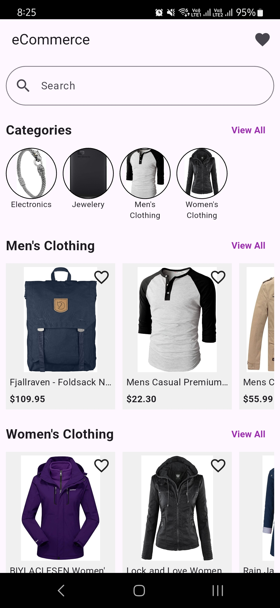
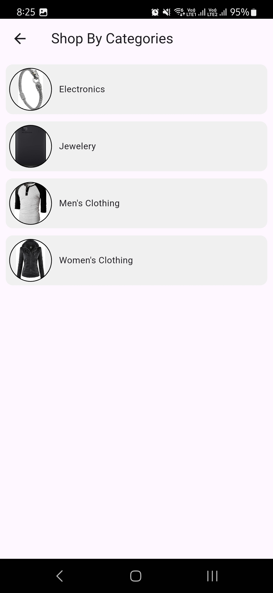
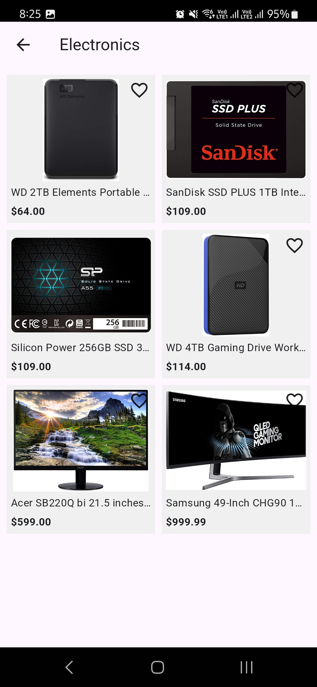
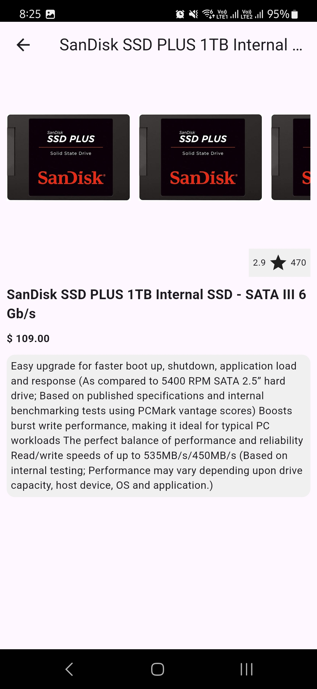
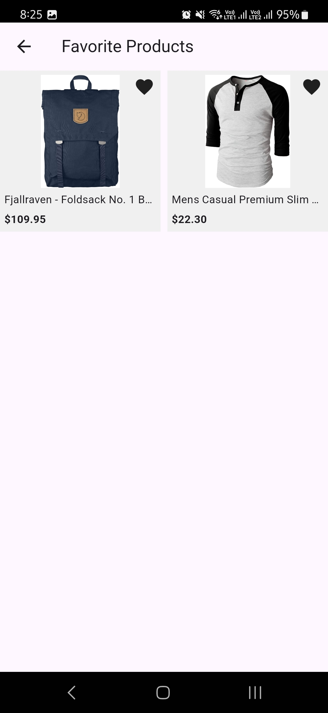

# Ecommerce

An ecommerce app built using Flutter.

## Features

- Uses fakestoreapi for displaying products
- Uses SQLite for storing favorites
- Follows Clean Architecture and TDD
- Used flutter_bloc for state management

## Screenshots

      
